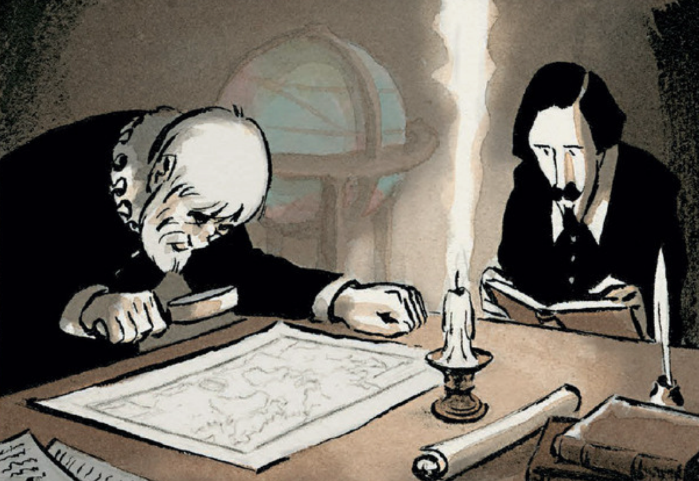
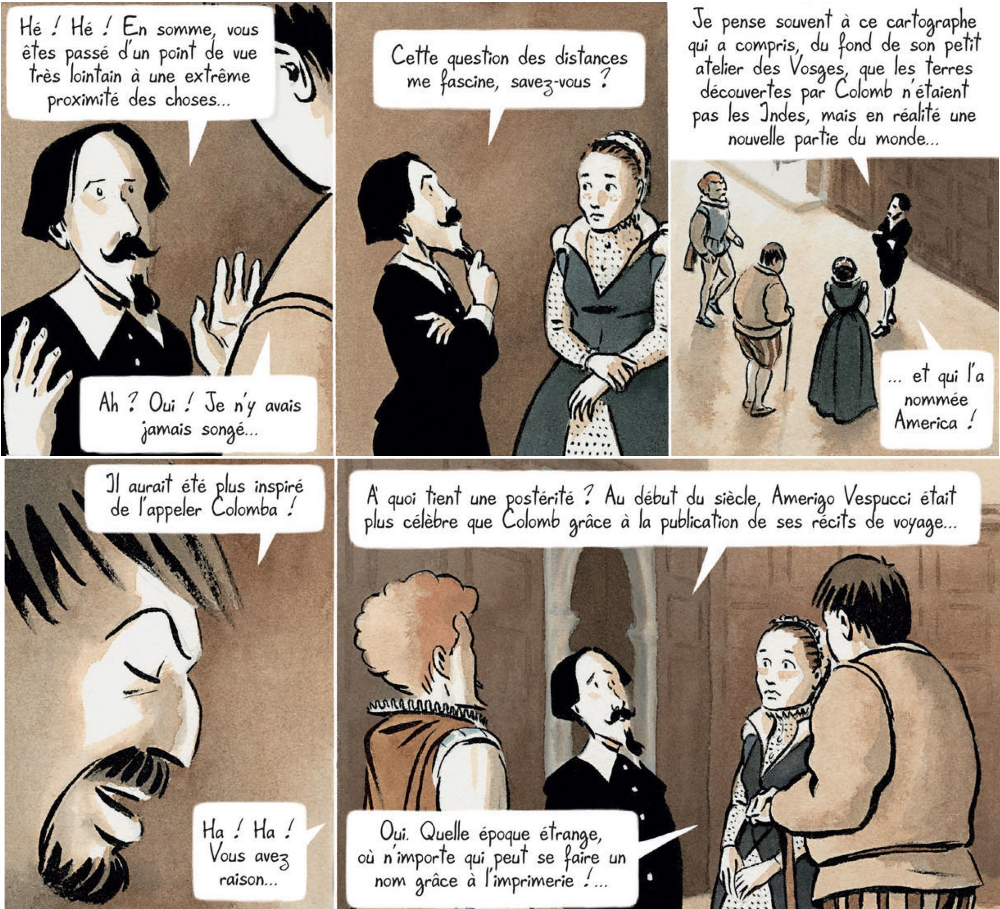
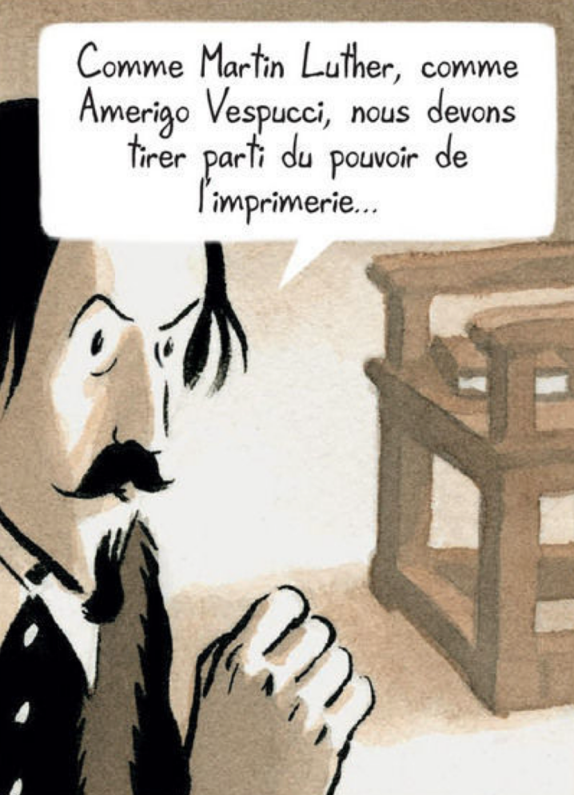
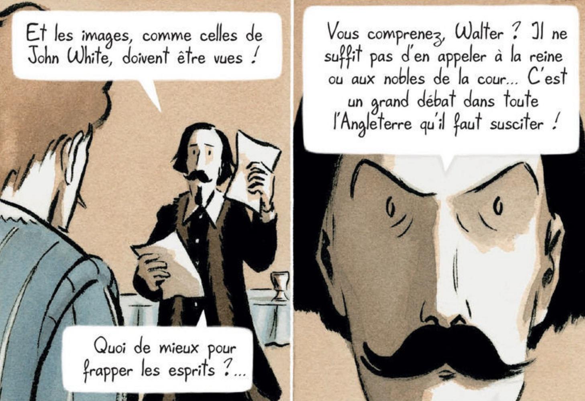
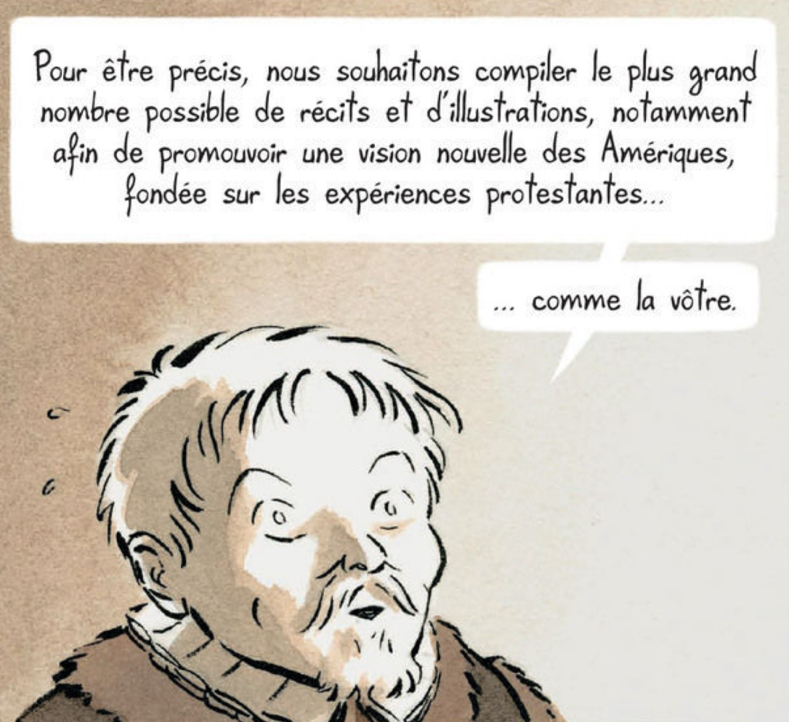
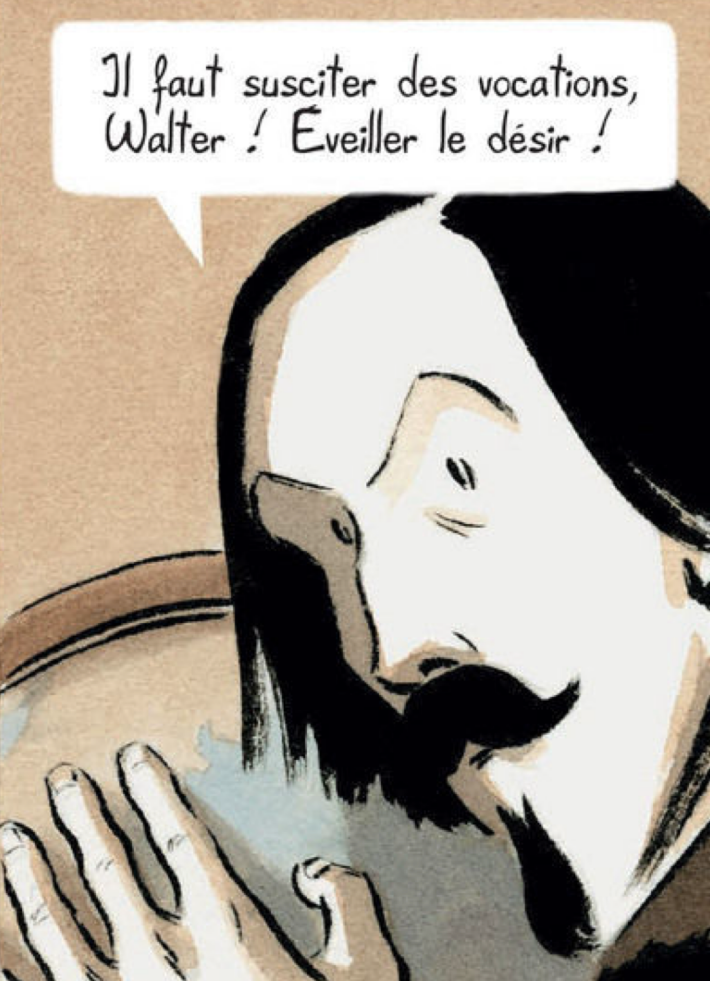
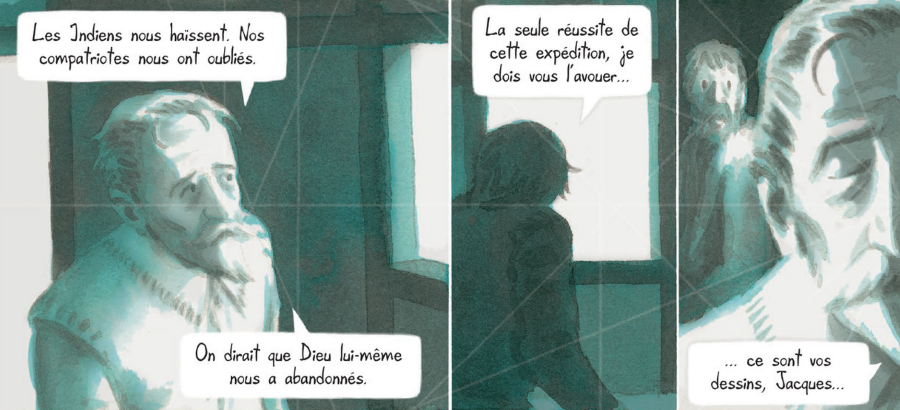
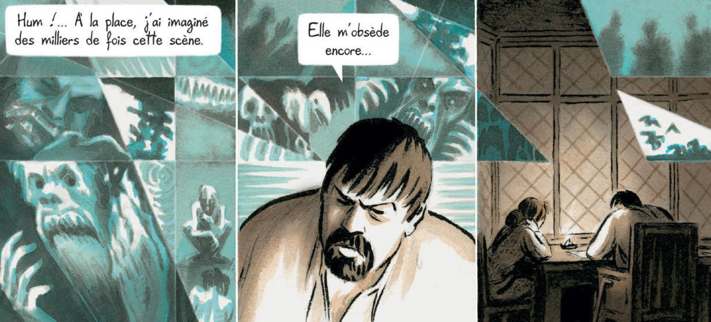
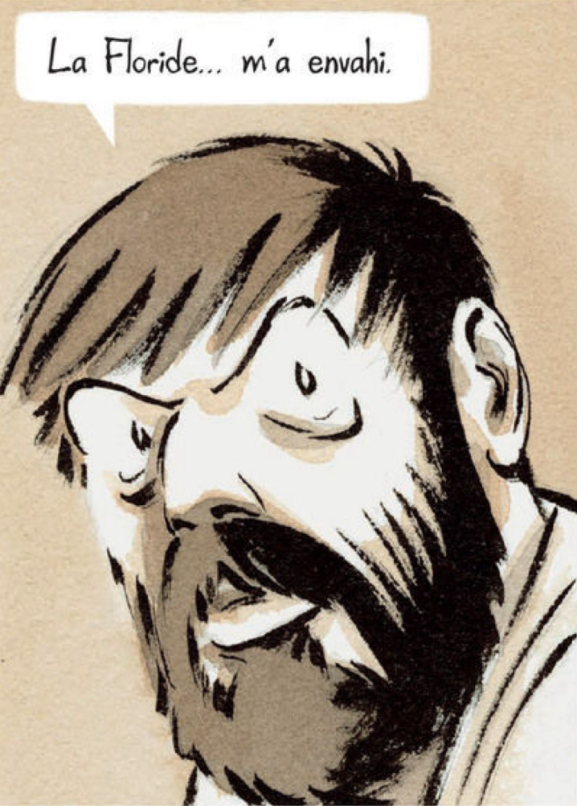

# “If Englande Crie oute, this Norumbega Offreth the Remedie”<!-- .element: class="r-fit-text" -->

## American Imaginaries after Cartography

<small>
<a href="http://moacir.com">Moacir P. de Sá Pereira</a> | <a href="http://twitter.com/muziejus">@muziejus</a> 
Research Data Librarian | <a href="http://library.columbia.edu">Columbia University Libraries</a>  
mpd2149@columbia.edu | <a href="http://pronoun.is/he">pronoun.is/he</a> 
“Under-Mapped Spaces” 
<a href="https://library.stanford.edu/rumsey">David Rumsey Map Center</a>, Stanford University, March 2022
</small>

Note: Thanks all for coming to this virtual talk, and thank you to Chloe,
Kelsey, and Riley for inviting me in the first place. Thanks also to Tyler and
the rest of the David Rumsey Map Center staff for making this talk possible.
Thanks also to the McCoy Family Center, Stanford Libraries, Stanford's Department of History, and the Stanford Provost for supporting Chloe, Kelsey, and Riley in implementing Under-Mapped Spaces.

My email and Twitter are here on the first slide, and they will be on the last slide. I don't often share my thoughts with a large audience like this, abut because what I will present is a work in progress, I leave the contact info as a mode by which the conversation can continue. 

Anyway, it's a shame we haven't been able to meet in person, but hopefully my talk and those of my colleagues will reach wider audiences instead.

Finally, I bring you all greetings from lands that have welcomed many peoples
to their shores, including, among others, the Lenape. 

---

“Tierra Nueva”

Note: Bringing up the Lenape makes some sense because the title of this talk, "if England crie out, this Norumbega offreth the Remedie," refers to a place whose name may have roots in an Algonkian language related to the Alkgonkian languages spoken by the Lenape. I'll have more to say about Norumbega as this talk opens up, but for now, suffice it to say that Norumbega is a mystery.

Here it is, styled as Tierra de Nurumberg, in a 1548 map that happens to be in the David Rumsey collection at Stanford Libraries. 

If I succeed with this talk, it will accomplish many things, but the central goal at this second is to build on a project I've been working on for a few years now. That is, I'm very interested in the stories of people who come to America, specifically the United States. These are definitionally stories of settlers who then live on stolen land, but these same settlers are often refugees, "tempest-tossed," in Emma Lazarus's well known words. 

Their stories grab me because they rely on a sense of space that bends and reshapes over the course of their migration and afterward. That is, before their journey, there is an "America" that exists as a geographic and political fact, but there is also the America that exists in their minds as a kind of America-to-come. They have constructed an American imaginary, in short. 
But as this imaginary solidifies, that is, in giving the American image detail, the image of the place they left behind—for whatever reason—also changes. So how do people talk about America before they've migrated there, and how do they talk about the place they left behind once they're in America? And then what if they leave America and return back to that place? 

These two places, America and origin, remain unstable. They are produced and reproduced as the people speak or think or dream. And even as they act, especially with the act of return. 

In the longer version of this talk, then, I consult an archive of novel-like objects (that are mostly just novels) and examine the mutability of their various spatialities, especially along the axis of America and not-America. How, then, can I describe these spatialities? How can I analyze them? Can I map them? What would those maps look like? 

I also look to and reason about the question of when or if these settlers and or refugees become AmericanS. And once they are Americans, do they ever stop being so?

The answers to these questions are preliminary at best, at least without a lot of other work to lead us (or me) to that point, which is why these questions lie in the background of tonight's talk, while I will instead focus on the questions of how to think about what these people say, not about what they say per se.

Cognizant of the theme of "under-mapped spaces," that brings these talks together, I aim to challenge the impulse that makes a mind, and perhaps specifically a Western mind, exercise mastery over a space by mapping it. If we are, as Matthew Edney proposes, moving past the cartographic ideal, which foregrounds the map as a representation of reality, toward a focus on mapping as a process, then how do we incorporate fixed moments of mapping in our analyses?

---

> If Englande crie oute and affirme, that there is so many in all trades that one cannot live for another, as in all places they doe, this Norumbega (if it be thoughte so goodd) offreth the remedie.

Note: The title of this talk closes a text printed in 1584, seemingly with an audience of one: Queen Elizabeth. The text's author never crossed the Atlantic, and the text's reader never did, either. But the text nevertheless describes and develops an American imaginary captured in the name Norumbega. This Norumbega, this America, could 

---

André Thevet and Richard Hakluyt.

Note: The author of the 1584 text, _A Discourse Concerning Western Planting_, is on the right side of this picture, reading a book. That's Richard Hakluyt, a star of tonight's talk. He's in Paris here, around the same time that he is writing the Discourse, in the study of the fellow on the left of the image, André Thevet, who at the time was a court cosmographer and serial plagiariser. Unlike Hakluyt, he _did_ cross the Atlantic, spending a few months as a chaplain in short-lived French settlement in what is now Rio de Janeiro in Brazil. 

Thevet had a knack for collecting accounts of others, compiling them, and publishing them as a narrative of his own travels. In the process of doing so, he acquired lots of information about the Americas as well as the Levant. Hakluyt, sent to Paris to serve in the British embassy as a collector of information concerning these new lands, would have been right at home in Thevet's study, eager to devour all the information therein.

Hakluyt never traveled farther from London than Paris, but he published scores of accounts of travels around the world, not just the Americas. Like the geographer in The Little Prince, Hakluyt stayed in his office and judged the veracity of tales he heard.

---

> Thus both hearing, and reading the obloquie of our nation and finding few or none of our owne men able to replie heerin… [I] determined notwithstanding all difficulties, to vndertake the burden of that worke wherin all others pretended either ignorance, or lacke of leasure, or want of sufficient argument, whereas (to speake truely) the huge toile, and the small profit to insue, were the chiefe causes of the refusall.

Note: While in France, Hakluyt writes in his main work, the multivolume _Principal Navigations_,of how he read and heard calumnies about English prowess in seafaring, especially in view of their lack of colonies. He chose to undertake the hard work of collecting the stories of English exploratory adventures to the north, west, and east, as he notes here, despite the cost. He was defending queen and country, and casts aspersions on those too lazy to defend their nation with the press. 

As we'll see during the rest of my talk, the press is a vital component to constructing the American Imaginary that Hakluyt promotes. When we first meet him in Jean Dytar's 2018 historical graphic novel _Florida_, he's at a party in the mid 1580s hosted by his friend Sir Walter Raleigh, musing about the name "America." 

<!-- [While in France] I both heard in speech, and read in books other nations miraculously extolled for their discoueries and notable enterprises by sea, but the English of all others for their sluggish security, and continuall neglect of the like attempts especially in so long and happy a time of peace, either ignominiously reported, or exceedingly condemned... --> 

---

Sir Walter Raleigh, Hakluyt, and Jacques Le Moyne de Morgues and his wife Eléonore.

Note: “I often think about this cartographer,” he says here, “who understood, from his tiny studio in Vosges, that the lands found by Columbus weren’t the Indies but were really a new part of the world, which he named ‘America.’” “America” took hold in lieu of “Columbia” (or something similar) because, as Hakluyt explains, “at the beginning of the [16th] century, Amerigo Vespucci was more famous than Columbus owing to the publication of his travel narratives.” At this point, one of the party’s guests, the historical center of the novel, artist Jacques Le Moyne de Morgues, intuits Hakluyt’s argument, responding, “What a strange time, where anyone can make a name for themselves because of printing.”

Before moving on, but to demonstrate the path we're taking, I want to underscore the word "cartographe," which here is an anachronism, as the term only emerged in the decades surrounding 1800. The anachronism, though, is a reminder of the touch of the author, whose 21st century hand and own American Imaginary is drawing and writing this text. 

Printing fires the imagination, generates momentum, establishes precedent, and persuades. Hakluyt in his writings gestures at nearly as many motivations for publishing his arguments and collections of narratives as reasons he gives for why England should colonize the Americas (the latter boiling down to 23 reasons). We've already seen that national pride is one, and it may be inextricable from the what seems to be the central, driving impulse: precisely that desire to colonize.

---

## _Florida_ in Brief

* c. 1552: Guillaume Le Testu meets Eléonore in Dieppe.
* 1564: Jacques joins the Florida expedition as mapmaker.
* 1565: Spanish destroy French colony in Florida.

* 1572: St. Bartholomew’s Day massacre. 
* c. 1583: Jacques and Eléonore meet Hakluyt.
* 1588: Jacques dies in London.
* 1591: Theodor De Bry prints Jacques’s Florida narrative.

Note: Now, there is a lot to say about this novel, so I will try to tell the same story, briefly, twice, to advance the novel's challenges to cartography and to the american imaginary. Once from the perspective of Hakluyt and his construction of his American Imaginary, and then once from Le Moyne's sense of America from his having lived there.

This timeline gives a sense of the events shown in the novel. I have split the events in the novel in half. Most of the "current" time of the novel is from 1583 to 1591, and these times are drawn with lots of ink and browns and blues. The flashbacks from before the massacre Dytar paints as watercolors in green and blue. 

---

“We have to take advantage of the power of the press.”

Note: Here is Hakluyt, saying that like Martin Luther and Amerigo Vespucci before him, he and his collaborators need to take advantage of the printing press. Over the course of the novel, Hakluyt's propagandizing mission solidifies. The main events of the novel begin around the time he publishes Diverse Voyages, which is a collection of narratives of exploration. Then he publishes the Discourse Concerning Western Plantings, specifically making the case to Queen Elizabeth and her court for the value in colonizing America or Norumbega. By this point, he is collecting the stories of English exploration that makes up the Principal Navigations. 

Dytar creates a sense of increasing calculation in Hakluyt. When he meets Le Moyne, he casually asks about Florida. By this point in the novel, he is practically hectoring Le Moyne for something he can print to help him convince the crown to finance colonization. 

In this scene, Hakluyt turns cold calculator upon visiting Raleigh. Dytar paints Raleigh as defeated over the bad news coming from Roanoke, but Hakluyt asks if at least there is new art regarding Virginia from the colonist artist John White.

---

“Not yet. Not yet. But it will come.”

Note: seeing the new art, Hakluyt responds optimistically. Raleigh counters that these documents don't make common people dream, or his investors, or the court, or the queen herself. These people want gold. They want subdued territory they can exploit. We have nothing of the sort, Raleigh finally declares. And here Dytar shows Hakluyt calmly sipping his drink, knowingly saying "not yet, not yet, but it will come."

Hakluyt's calm in this section underscores how much he values the imaginary he's constructing for the English public as a whole. 

---

“What we must arouse is a great, England-wide debate.”

Note: Now Hakluyt grows animated. John White's images must be seen by as large a public as possible, he argues, and the America in the minds of the English must change from a place of terror and failure and instead become precisely the sort of place the English would eagerly colonize. As a result, the importance of Le Moyne's narrative—and his images—becomes even more central to the project. 

---

“We want to promote a new vision of the Americas, based on the Protestant experience.”

Note: To this end, Hakluyt recruits Theodor de Bry, a Protestant printer and engraver who has fled Spanish repression in the low countries and established himself in Frankfurt. Dytar shows De Bry pleading with Le Moyne to help him promote the idea of a Protestant America, shifting the imaginary again from an America colonized by the English to a specifically *Protestant* America colonized by the English and other protestants. After all, both previous French attempts, in Brazil and in Florida, were effectively exercises in creating havens for Huguenots. 

Jacques dies shortly thereafter, and Hakluyt leans on Eléonore to provide him with any material Jacques may have left behind about America. He had, in fact, begun writing a narrative for his daughters before his death, but Dytar shows that the accompanying images are unusable. Eléonore, who grew up surrounded by mapmakers, forges a map of Florida and gives it to Hakluyt along with her husband's text. 

Showing the various conflicts at play, De Bry refuses the package, saying that the images are precisely what made Jacque's story so appealing. First hand drawings that pre-date John White's would make quite a splash on the European market. But calculating Hakluyt has a plan.

---

“I’ve got something even better!”

Note: Here Dytar moves into ground covered in many of his other texts, namely the question of what authorship actually is. De Bry needs pictures for his book. Le Moyne has provided none. De Bry then strikes upon the idea of creating their own images, and Hakluyt suggests using already existing imagery from Thevet's book about Brazil, from John White's drawings, and, worse still, from the Codex Mendoza, which Hakluyt has bought from Thevet. The men will publish an amalgam, inventing new native Americans out of whole cloth. Dytar even provides a visual joke, comparing the pose in one of De Bry's early sketches with the replica of Augustus of Prima Porta on Hakluyt's mantle, drawing upon the trope of the natives as though people descended straight from classical antiquity. 

In the meantime, Hakluyt insists that De Bry show nothing of the grim fate that befell the French in Florida. The images must be inviting and inspiring.

---

Jacques Le Moyne’s family admires “his” map.

Note: Dytar proposes that the images that accompany Le Moyne's text, when it is published in 1591, are a complete fabrication. A mashup of the details Le Moyne has provided in his text with pictures from Brazil, Mexico, and Virginia. What's more, the map is an invention provided by Eléonore, given verisimilitude by adding toponyms. 

De Bry and Hakluyt have introduced—and, more importantly with its etymological cousin—_pro_duced an America for the European public. De Bry promises to publish the narrative in French, German, and Latin, to ensure a wide readership. Additionally, Hakluyt directs an aesthetic that can affect people who can't read the text. Jacques's family can't read Latin--they rely on his son in law to read the story, but the family crowds around the text to take in the pictures, the traces, allegedly of their father's hand. 

---

> La Pérouse does something that is going to create an enormous difference between the [Ainu] and the European. What is, for the former, a drawing of no importance that the tide may erase, is for the latter the single object of his mission.

Note: Bruno Latour tells the story of La Pérouse's tracing the pacific coastline in 1787. Louis 16th has sent the explorer on this mission precisely to create a better map of the area, and La Pérouse asks the local Ainu (Latour calls them "Chinese." The 80s were wild) if the land they are on is an island or a peninsula. An elder draws in the sand a map showing it is an island that we now know as Sakhalin, in Russia, while a younger Ainu hurriedly reproduces the sand drawing in a notebook for the Frenchman. 

Latour's emphasis on the "single object" here resonates with Hakluyt's calculations. He needs images of the Americas in order to build the imaginary. Louis 16th needs maps to build his imaginary of the Pacific and where the Amur River meets the ocean. Latour explains how the map is needed to settle debates, to determine land ownership, to plot commercial travel. But his map must also convince the people back in Versailles. Lapérouse not only polishes an imaginary here, but he also seeks converts to it. 

The instrumentality of Hakluyt's work shows its kinship to Latour's sense of "paper-work." Hakluyt's books are mobile yet immutable yet reproducible and recombinable and annotatable. They not only build images but provide a foundation for future images, for that future of a docile and dominated America ready to quote unquote accept English settlers. 

---

“We must arouse callings, Walter! Awaken desire!”

Note: In Hakluyt, Dytar levies a critique on the Western practice of constructing imaginaries and assuming them to be representations of reality. We as readers believe Le Moyne is presenting factual information and factual records of the real in America because, I don't know, books don't lie. For Latour, this is part of the lie we Westerners tell ourselves to demonstrate that we are modern, in contrast, say, to the Ainu or the Timucua Le Moyne meets. 

Dytar shows the emptiness behind these facts. The map is drawn by Eléonore. The pictures are photoshops by De Bry under Hakluyt's art direction. The text itself is incomplete when it comes into Hakluyt's hands. Furthermore, Hakluyt makes no pretense of chasing after truth. He is clear that he wants England to establish itself in the Americas, convert the Natives, exploit the raw materials in that Norumbega, and build an empire. And he has the facts for why right here for you to read.

By so troubling the authorship of the map of Florida and thereby troubling also the provenance of De Bry's engravings, Dytar enforces with ink and water color what geographers and people who study maps, like the audience assembled tonight, have known for years. Maps lie.

---

>Geographical maps are embodiments of multifaceted, historical practices among specific humans and nonhumans… Maps are models of worlds crafted through and for specific practices of intervening and particular ways of life.

Note: I particularly like Haraway's reminder of this fact because of two key words: crafted and intervening. Crafting, like the artistry central to the tale Dytar weaves, reminds us that the maps, that these alleged represations, are made by hands. It's notable that Le Moyne is both a map maker and a fine artist. In fact, Dytar shows Le Moyne as having abandoned his cosmographic and artistic pursuits upon his arrival in London. He is known exclusively as a painter of still lifes, studies of single flowers or a single fruit. The map-maker's craft resonates with the painter's art. More important, however, is Haraway's note about the relationship between mapping and intervention. The map La Pérouse brings back to Versailles is a trace of his intervention in the lives of the Ainu. And the portability of the "paper-work" of the map ensures future interventions. The entire colonial project, fed by the maps traveling back across the Atlantic, is a practice in intervening.

---

“It made me cry.”

Note: So that's the story of Dytar's novel from Hakluyt's perspective. It's one of power and control, wherein men who never crossed the Atlantic nevertheless create an America for their neighbors. Now, in contrast, we can see the story from Jacques Le Moyne's perspective. I mentioned above that Dytar creates in two different formats in this novel, keeping the ink and sepia tones for "current" events but rendering flashbacks in this wash of blues and greens. To me it's arresting, and the bottom panel, which is also the cover of the novel, stopped me cold. I immediately wanted to know that story.

However, Dytar includes another graphic element in the flashbacks that further attaches his novel to the art and craft of making maps. Every panel from the past is criss-crossed by rhumb lines or windrose lines, characteristic of the portolan charts that predate the historical era of the novel. On the map attributed to Le Moyne, of course, there are no such lines. But Dytar's use of the lines creates opportunities for visual trickery. On the one hand, the place the events further in the past by using techniques from the past. On the other, one can feel that they add a layer of credibility to the histories. The lines on the chart calm the skeptical reader by placing the passage of time within the spatial stability we, immersed in the cartographic ideal, expect from our maps. But the rhumb lines do more, showing the fissures and fractures in Le Moyne's mind as he has attempted to reject Hakluyt's American imaginary. 

---

“May God rest his…” 

Note: Hakluyt needles Jacques at the party where they meet, seemingly innocently asking about various people in France as he prepares for his trip there. Hakluyt's skills at collecting intelligence are still weak, and Jacques becomes irritated at the line of questioning. Hakluyt reminds Jacques of Jean Ribault, the Protestant leader who was killed by the Spanish in Florida, and the panel shatters for the first time. Dytar's sliver of a flower, painted in the style of post-Florida Le Moyne, shows the cracking in Jacques himself. At dinner, however, it's Raleigh who pushes the topic of Florida and English colonization, causing Jacques to explode.

---

“Why should we settle for crumbs when we could have a whole piece of cake?”

Note: Dytar includes fragments of Jacques's painting shattering around him, the sharp slivers recalling the intersections of rhumblines on those old portolan charts. Raleigh's casual discussion of the French failures (échecs) in Brazil and Florida prove to be too much, and Jacques asks Eléonore to accompany him home.

In the language of 2018, we would say that Jacques has suffered an immense trauma over his time in Florida, leaving him with memories he would rather not consider. This leaves him as a ghost to his children, an unknown cipher to all around him. It's Hakluyt's persistence that breaks him down and allows him to describe the horror of the journey to Eléonore.

---

“My drawings could give an accurate picture of our America.”

Note: Dytar paints in detail the folly of the French settlement in Florida. Le Moyne explains the capricious folly of the leadership on a perpetual search for gold and the toll it took on relationships with the Natives, as the french double crossed their way chasing phantom mines that never existed. He describes the folly of the evangelical mission, noting that they didn't bring along a single particularly religious person. And then he describes how the colony ran out of food and began to mutiny. Foreshadowing Hakluyt's later interest, Jacques explains to Eléonore that the only thing that would end up having any value from the experience were his drawings, drawings that could give an accurate picture of an America he increasingly believed should belong to the Natives.

Jacques had been hiding his drawings, having been brought along mostly for his skills as a map-maker. He was drawing, he explains, mostly for Eléonore, but once leadership learns of the drawings they immediately sense their value in an audience with king Charles 9th. As the colonists begin starving, however, the leader of the colony, René Laudonnière, visits Le Moyne and asks to see his drawings.

---

Note: Le Moyne and Laudonnière have been ravaged by famine, and the anguish in the latter's face in this spread underscores how he understands his project to be lost. There is no gold in Le Moyne's images, no spice or precious stones. Instead, Le Moyne has captured the quotidian lives of the Timucua and the settlers, including the two marooned Spaniards they met who said all the gold they saw in these lands had washed ashore from wrecked Spanish galleons coming from Mexico or Peru. 

Again Dytar uses the rhumblines to provide edges for the images, which are now shards cutting through Laudonnière's image of their mission. These lines are supposed to aid in navigation, but the French are now completely lost.

---

“Your drawings are the sole success of this expedition, Jacques.”

Note: Laudonnière repeats Le Moyne's earlier comment, where the French folly has led the men to such a state where only Jacques's drawings are a success. The indians hate us, Laudonnière remarks, and our compatriots have forgotten us. We could say that even God himself as abandoned us.

---

“I’ve imagined this scene thousands of times.”

Note: Jacques's fellow settlers, starving, raid his lodgings and demand he give up all of his paper so they can eat it. At first they're content with just the blank pages, but eventually they come for the drawings as well and devour them.

The violent images of famished Frenchmen tearing through paper fills the map in Le Moyne's mind. The one good thing about the whole expedition is gone. Not for nothing that Dytar shows Le Moyne feeling that the Europeans have no business in America. 

---

“Does the land belong to those who stole it?”

Note: Raleigh visits Le Moyne once again, and the two argue over the impending invasion by the Spanish Armada. Le Moyne argues that if we see Spain's invasion as illegitimate, then we should see the invasion of the Americas in the same way. Raleigh asks who actually owns the land. The argument ends with Raleigh's punching Le Moyne, who tumbles down the stairs and dies.

Dytar manifests in Raleigh's fist the power of the American Imaginary. The only man in this entire novel who has been to North America is interested in telling the story only so that his daughters may know him better, and even so, he is pressured to do it by Eléonore.

Raleigh, Hakluyt, and De Bry want to take Le Moyne's story from him to mobilize it for their colonial and religious ends. They hector Le Moyne over the course of the novel, and Le Moyne's resistance to framing his trauma anew costs him his life. What's worse, the propgandists didn't even need Le Moyne's drawings or maps. 

---

“Tierra Nueva”

Note: Writing about the origin of the name "Norumbega," Richard d'Abate refers to this map, with which I've opened tonight's discussion, noting that it's "an attempt to show the Verrazzano discoveries [of 1524] and burgeoning concept of a 'Norumbega' region could work together." After all, as d'Abate writes, living "in the representations of a New World rather than in the New World itself [was] to inhabit a fluid region," one open to change, addition, and reformulation. Regardless of the people living in those territories, Hakluyt was warping the image of America with each new rumor of an explorer eager to relate what they saw. In fact, when Eléonore presents Hakluyt with her forged map, his first remark is that it's out of date.

---

“The Americas… They’re always changing from one map to the next.”

Note: I haven't yet figured out what to do with Eléonore in Dytar's work. First, she seems to be wholly invented by Dytar, down to her name. Nevertheless, she is more active in pushing Dytar's narrative forward than her husband is, and she has a particularly close relationship to map-making, having grown up among map-makers in Dieppe. In fact, her flashback to meeting Guillaume Le Testu around 1552 when he returned to Dieppe is the first such flashback in the novel and establishes the importance of the map to the work as a whole, one Jacques persistently challenges as noted above.

Nevertheless, when she's a little girl in Dieppe, watching Le Testu draw a map, he gives her a little geography quiz. She identifies the Americas, before adding that they are always changing from one map to the next.

---

Note: This is a slide I have reused in variety of contexts for the past three years, largely since I'm not done thinking through it. But it also fits here, as I close my talk. Doreen Massey opens _For Space_ juxtaposing these two images. On the left is a facsimile of a map of Tenochtitlan from the Codex Mendoza, the very book that Hakluyt bought from Thevet, who himself acquired it after it was pilfered from a Spanish galleon. On the right is a map of the same city, now called Mexico City, drawn by Hernán Cortés.

Investigating the epistemology of the mapmaking that went into Cortés's map, Massey points out how thinking of space in terms of areas to conquer and turn into colonies is linked to the image of space as flat and continuous. When we read a Western map, of course, we understand its edges as a fiction in place to focus our attention on the map's extent. We know from experience that the border is a printing convention and not the actual edge of space. The territory extends in all directions.

The problem is with this surfaced space is the way in which others are just impediments to moving across the surface. The Timucua are impediments to Laudonnière's finding the Appalachian gold. Worse yet, we deny their own spatial trajectories, understanding them as coming into existence only upon their "discovery" by Europeans. 

---

“Florida has overwhelmed me.”

Note: And this is the distinction between Le Moyne's understanding of Florida and Hakluyt's. Le Moyne wanted to document what Massey calls the challenge of the contemporaneity of others. The Timucua had a trajectory of their own, and Dytar aims to capture that in Le Moyne's memories, fragmented both narratively and literally as shards edged by rhumblines. For Hakulyt, the Natives have no contemporaneity—they are antiquity made flesh, a backward people not yet brought to Christ and inhabiting a land most inefficiently. Hakluyt's story keeps moving forward, barreling towards the realization of his life's goal of English colonization of America, whether subdivided as Norumbega, Virginia, or otherwise. Le Moyne remains subsumed by his contact with the others, overwhelmed and invaded by his traumas, both at the French negligence and the Spanish brutality. Hakluyt instead moves forward, inhabiting the value of Latour's paper-work.

---

> [Under the cartographic ideal,] cartographers’ moral duty is to strive to make the best maps possible. Cartography disciplines spatial data, improving them so that they fit a norm and uplifting them until they are correct and truthful. Any other process denies the propriety of the scientific search for truth.

Note: When Eléonore tells Le Testu that the Americas keep changing from one map to the next, the ten year old girl fully encapsulates how Hakluyt's American Imaginary, especially in Dytar's hands, becomes an extension of what Matthew Edney has called the cartographic ideal. The "after cartography" in my paper's talk refers to this ideal. 

Here is where we can return to Hakluyt's anachronistic use of the term "cartographer" or "cartographe" from before. As I noted, the term only appears around 1800. Until that point, Edney argues, maps, charts, and the like were all different and had their own spatialities. Over the course of the nineteenth and twentieth century, however, map making became the science of cartography, where all writing about the earth was unified by projective geometry and scale. Even as geography has undergone its critical period followed by the GIS wars, and even as various critique-based disciplines in the humanities have undergone their spatial turns, the ideal remains more reproduced now than ever before, especially with the stultifying projection of Web Mercator that infects every online map.

Edney breaks the cartographic ideal down into ten components, such as how the cartographic map shares an ontological relationship with the world archive as a reduction of it, repeated in the map's unmediated and mimetic representation of the world. Maps are grounded in observation and measurement—no Norumbegas anymore—and if they are incorrect, they are later to be corrected in an act of discipline that also favors the public role maps enjoy. The penultimate component ties with the disciplinary one--one of the moral duty of cartographers to, in the name of truth, keep correcting their maps. Hence Hakluyt's teasing Eléonore and her own unintentional rewriting of the "correct" Americas as they keep changing on the maps she sees.

And the reason maps can be corrected is in contrast to what I said before. Maps don't lie. They all tell the same truth because there is only one map, just as there is only one world. What changes are scales and extents. As we reproject and layer geospatial dataset upon geospatial dataset within our geographical information systems, we rely on the radical commensurability of one map with another. They all, after all, can be reduced to the world. And this is science.

---

> [Vision] has been used to signify a leap out of the marked body and into a
conquering gaze from nowhere… In this technological feast [it] becomes
unregulated gluttony; all perspective gives way to infinitely mobile vision,
which no longer seems just mythically about the god-trick of seeing everything
from nowhere, but to have put the myth into ordinary practice. And like the
god-trick, this eye fucks the world to make techno-monsters.

Note: No one I have read critiques the universalizing impulse of one world one map quite like Haraway, who elsewhere calls cartography the chief tool-metaphor of technoscience. The flat map of the flat world gives us readers that conquering gaze. The conquest here resonates with the intervention from the previous Haraway quote, and we can see how Dytar's propagandizers anachronistically slide into these same fantasies. Hakluyt's confidence in the success of the settler project emerges from his own conquering gaze, though not as a cartographer but as a collector of narratives. Compare, again, to Le Moyne, who has no conquering gaze. His maps were useless and his efforts were ethnographic, not conquistatorial. Haraway's techno-monsters then are the English boats using the intervention of Hakluyt's narratives to arrive on the shores of the America in greater and greater numbers.

---

> Mirado desde arriba, el mundo es muy pequeño porque prescinde de las personas y, en su lugar, hay un número de una cuenta bancaria, sin más movimiento que el de los ingresos.

>Seen from above, the world is very small, because all the people are gone with a bank account number left in their place, and the only movement is the flowing of revenue.

Note: Moving back even further, to the very beginning of tonight's talk, I return to my curiosity over the "under-" in "under-mapped spaces." One way of reading that, one very much in line with the Edney's cartographic ideal and Hakluyt's American imaginary is to see it as a problem technoscience can solve. Spaces are under mapped in the way a professor might say a student's essay is under-theorized or in the way the IMF would deem a nation under-developed, right before loans leave the nation underwater.

Cartographers have the moral responsibility, after all, to make maps as accurate as possible, which means contributing to the singularity of one map/one world. The danger, however, is the erasure from taking on that conquering gaze. Here I have a part of Durito's long response to Subcomandante Marcos's question of how large is the world. Viewed from above, under-mapping is easily solved. Move more revenue, send more street view cars, etc., erasing the specific spatiotemporalities Massey traces. Viewed from above, the entire world becomes available for English colonization. 

The idea of the tiny world sets a powerful image for Durito and, consequently for the project of ensuring the spaces are properly mapped or that land is effeciently used, and so on. The world when it is so small can be grasped and simplified. It can be modeled on economists’ laptops. 

But Subcomandante Marcos's tobacco smoking, cocky cockroach friend isn't finished with his answer regarding the size of the world.

---

> Pero si lo miras desde abajo, el mundo se ensancha tanto que no basta una mirada para envolverlo… Mirado desde abajo, el mundo abunda en mundos, casi todos pintados con el dolor del despojo.

> But if you look at it from below, the world swells such that one glance is not enough to take it all in. Seen from below, the world abounds in worlds, almost all of them painted with the pain of plunder. 

Note: This is the other way of reading under-mapped spaces, as a mapping from below, where considering what Massey calls the "challenge of space" is never complete. This is the mapping after cartography, where we no longer make maps but rather engage in mapping, to use Edney's formulation. No longer is one American imaginary sufficient to mobilize all of England to find the Remedie in Norumbega.

---

Note: So we go back to work and confront the failures of our spatial imaginations. As Massey writes, this failure is the sense of "being inadequate to face up
to the challenges of space; a failure to take on board its coeval
multiplicities, to accept its radical contemporaneity, to deal with its
constitutive complexity." At the libraries, I'm often asking the researchers who meet with me why they feel they need a map. Instead of teaching them to make a map, I should teach them to stay mapping.

---

# Thanks!

## @muziejus / moacir.p@columbia.edu

---

### Bibliography

* Abate, Richard d’. “On the Meaning of a Name: ‘Norumbega’ and the Representation of North America.” In _American Beginnings: Exploration, Culture, and Cartography in the Land of Norumbega_, edited by Emerson W. Baker. Lincoln: University of Nebraska Press, 1994.
* Cortés, Hernán. “[Mexico City and the Gulf of Mexico](https://www.newberry.org/file/hern-n-cort-s-mexico-city-1524-woodcut-vault-ayer-65551c8-1524d-0).” In _Praeclara Ferdina[n]Di Cortesii de Noua Maris Oceani Hyspania Narratio Sacratissimo, Ac Inuictissimo Carolo Romanoru[m] Imperatori Semper Augusto, Hyspaniaru[m] &c. Regi Anno Domini M.D.XX. Transmissa : In qua Continentur Plurima Scitu, & Admiratione Digna circa Egregias Earu[m] p[Ro]Uintiaru[m] Urbes, Incolaru[m] Mores, Pueroru[m] Sacrificia, & Reliogiosas Personas, Potissimu[m]q[Ue] de Celebri Ciuitate Temixtitan Variisq[Ue] Illi[Us] Mirabilib[Us], Qu[a]e Lege[n]Te[m] Mirifice Delectabu[n]t_. Nuremberg: Friederich Peypus, 1524. Ayer 655.51.c8 1524b. Edward E. Ayer Collection, Newberry Library, Chicago.
* Dytar, Jean. _Florida_. Paris: Delcourt, 2018.
* Edney, Matthew H. _Cartography: The Ideal and Its History_. Chicago: University of Chicago Press, 2019.
* Gastaldi, Giacomo. “Tierra Nueva.” In Ptolemy, Claudius, Giacomo Gastaldi, Pietro Andrea Mattioli, and Giovanbattista Pedrezano. _La Geografia Di Claudio Ptolemeo Alessandrino    ... In Venetia, ... per Gioan. Baptista Pedrezano ... Anni x. M.D.XLVIII (1548)_. 1:30,000. David Rumsey Map Collection at Stanford University Libraries. Venetia: Gioan. Baptista Pedrezano, 1548.
* Hakluyt, Richard. _A Particuler Discourse Concerninge the Greate Necessitie and Manifolde Commodyties That Are Like to Growe to This Realme of Englande by the Westerne Discoueries Lately Attempted, Written in the Yere 1584_ [1584]. In _A Discourse Concerning Western Planting Written in the Year 1584_, edited by Charles Deane. Cambridge, MA: Maine Historical Society, 1877.
* ———. _The Principal Navigations, Voyages, Traffiques, and Discoveries of the English Nation_ [1599]. Edinburgh: E. & G. Goldsmid, 1885. 
* Haraway, Donna. _Modest_Witness@Second_Millennium.FemaleMan_Meets_OncoMouse: Feminism and Technoscience_. New York: Routledge, 1997.
* ———. _Simians, Cyborgs, and Women: The Reinvention of Nature_. New York: Routledge, 1991.
* Latour, Bruno. “Visualisation and Cognition: Drawing Things Together.” _Knowledge and Society Studies in the Sociology of Culture Past and Present_ 6 (1986): 1–40.
* Mancall, Peter C. _Hakluyt’s Promise: An Elizabethan’s Obsession for an English America_. New Haven: Yale University Press, 2007.
* Massey, Doreen. _For Space_. London: SAGE, 2005.
* Smith, Thomas. “[‘Codex Mendoza,’ Etc](https://digital.bodleian.ox.ac.uk/objects/2fea788e-2aa2-4f08-b6d9-648c00486220/).” c 1541. MS. Arch. Selden. A. 1. Bodleian Library. 
* Subcomandante Marcos. “[¿Qué Tan Grande Es El Mundo?](http://enlacezapatista.ezln.org.mx/2006/02/17/en-la-ibero-puebla-17-de-febrero/)” 2006. 

<!-- Giovanni da Verrazzano, whose name is affixed to a bridge fewer than 20 miles away from me, apparently found a place named Norumbega, though he never used the word himself, during his visit to this continent in 1524. Instead, it appears for the first time in a map drawn by his brother a few years later. These wheels in motion, the myth of Norumbega grew, a --> 

<!-- He refers to a place called "El Refugio," understood to be contemp -->

