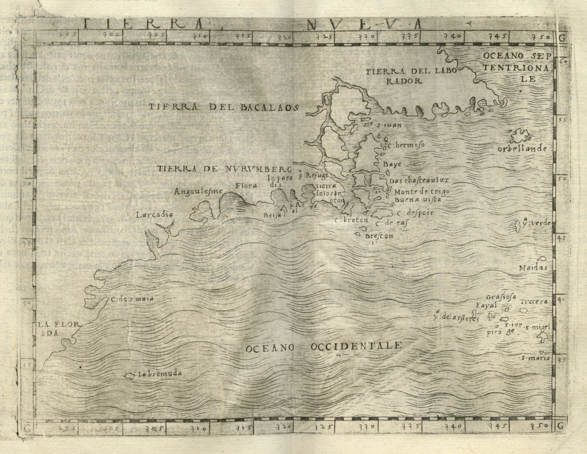

# “If Englande Crie oute, this Norumbega Offreth the Remedie”<!-- .element: class="r-fit-text" -->

## American Imaginaries after Cartography

<small>
<a href="http://moacir.com">Moacir P. de Sá Pereira</a> | <a href="http://twitter.com/muziejus">@muziejus</a> 
Research Data Librarian | <a href="http://library.columbia.edu">Columbia University Libraries</a>  
mpd2149@columbia.edu | <a href="http://pronoun.is/he">pronoun.is/he</a> 
“Under-Mapped Spaces” 
<a href="https://library.stanford.edu/rumsey">David Rumsey Map Center</a>, Stanford University, March 2022
</small>

Note: Thanks all for coming to this virtual talk, and thank you to Chloe,
Kelsey, and Riley for inviting me in the first place. Thanks also to Tyler and
the rest of the David Rumsey Map Center staff for making this talk possible.
Thanks also to the McCoy Family Center, Stanford Libraries, Stanford's Department of History, and the Stanford Provost for supporting Chloe, Kelsey, and Riley in implementing Under-Mapped Spaces.

My email and Twitter are here on the first slide, and they will be on the last slide. I don't often share my thoughts with a large audience like this, abut because what I will present is a work in progress, I leave the contact info as a mode by which the conversation can continue. 

Anyway, it's a shame we haven't been able to meet in person, but hopefully my talk and those of my colleagues will reach wider audiences instead.

Finally, I bring you all greetings from lands that have welcomed many peoples
to their shores, including, among others, the Lenape. 

---

“Tierra Nueva”1

Note: Bringing up the Lenape makes some sense because the title of this talk, "if England crie out, this Norumbega offreth the Remedie," refers to a place whose name may have roots in an Algonkian language related to the Alkgonkian languages spoken by the Lenape. I'll have more to say about Norumbega as this talk opens up, but for now, suffice it to say that Norumbega is a mystery.

Here it is, styled as Tierra de Nurumberg, in a 1548 map that happens to be in the David Rumsey collection at Stanford Libraries. 

If I succeed with this talk, it will accomplish many things, but the central goal at this second is to build on a project I've been working on for a few years now. That is, I'm very interested in the stories of people who come to America, specifically the United States. These are definitionally stories of settlers who then live on stolen land, but these same settlers are often refugees, "tempest-tossed," in Emma Lazarus's well known words. 

Their stories grab me because they rely on a sense of space that bends and reshapes over the course of their migration and afterward. That is, before their journey, there is an "America" that exists as a geographic and political fact, but there is also the America that exists in their minds as a kind of America-to-come. They have constructed an American imaginary, in short. 
But as this imaginary solidifies, that is, in giving the American image detail, the image of the place they left behind—for whatever reason—also changes. So how do people talk about America before they've migrated there, and how do they talk about the place they left behind once they're in America? And then what if they leave America and return back to that place? 

These two places, America and origin, remain unstable. They are produced and reproduced as the people speak or think or dream. And even as they act, especially with the act of return. 

In the longer version of this talk, then, I consult an archive of novel-like objects (that are mostly just novels) and examine the mutability of their various spatialities, especially along the axis of America and not-America. How, then, can I describe these spatialities? How can I analyze them? Can I map them? What would those maps look like? 

I also look to and reason about the question of when or if these settlers and or refugees become AmericanS. And once they are Americans, do they ever stop being so?

The answers to these questions are preliminary at best, at least without a lot of other work to lead us (or me) to that point, which is why these questions lie in the background of tonight's talk, while I will instead focus on the questions of how to think about what these people say, not about what they say per se.

Cognizant of the theme of "under-mapped spaces," that brings these talks together, I aim to challenge the impulse that makes a mind, and perhaps specifically a Western mind, exercise mastery over a space by mapping it. If we are, as Matthew Edney proposes, moving past the cartographic ideal, which fetishises the map as a representation of reality, toward a focus on mapping as a process, then how do we incorporate fixed moments of mapping in our analyses?

---

> If Englande crie oute and affirme, that there is so many in all trades that one cannot live for another, as in all places they doe, this Norumbega (if it be thoughte so goodd) offreth the remedie.1

Note: The title of this talk closes a text printed in 1584, seemingly with an audience of one: Queen Elizabeth. The text's author never crossed the Atlantic, and the text's reader never did, either. But the text nevertheless describes and develops an American imaginary captured in the name Norumbega. This Norumbega, this America, could 

---

André Thevet and Richard Hakluyt.1

Note: The author of the 1584 text, _A Discourse Concerning Western Planting_, is on the right side of this picture, reading a book. That's Richard Hakluyt, a star of tonight's talk. He's in Paris here, around the same time that he is writing the Discourse, in the study of the fellow on the left of the image, André Thevet, who at the time was a court cosmographer and serial plagiariser. Unlike Hakluyt, he did cross the Atlantic, spending a few months as a chaplain in short-lived French settlement in what is now Rio de Janeiro in Brazil. 

Thevet had a knack for collecting accounts of others, compiling them, and publishing them as a narrative of his own travels. In the process of doing so, he acquired lots of information about the Americas as well as the levant. Hakluyt, sent to Paris to serve in the British embassy as a collector of information concerning these new lands, would have been right at home in Thevet's study, eager to devour all the information therein.

Giovanni da Verrazzano, whose name is affixed to a bridge fewer than 20 miles away from me, apparently found a place named Norumbega, though he never used the word himself, during his visit to this continent in 1524. Instead, it appears for the first time in a map drawn by his brother a few years later. These wheels in motion, the myth of Norumbega grew, a 

He refers to a place called "El Refugio," understood to be contemp

1584 Plantings... comprehensive statement of English colonization. 

---

## Latour and “Paper-work” <!-- .element: class="r-fit-text" -->

* Mobile yet Immutable
* Flat
* Modifiable Scale
* Free to Reproduce
* Recombinable / Superimposable / Annotatable
* Geometric

Latour, <a href="http://www.bruno-latour.fr/node/293.html">“Visualisation and Cognition: Drawing Things Together”</a>

Note: Latour tells the story of La Pérouse, sent from Versailles to determine
whether Sakhalin is an island.

---

[_Codex Mendoza_](https://codicemendoza.inah.gob.mx/inicio.php) (c.1541) and Cortés, [_Mexico City_](https://www.newberry.org/file/hern-n-cort-s-mexico-city-1524-woodcut-vault-ayer-65551c8-1524d-0) (1524), in [Massey, _For Space_](https://uk.sagepub.com/en-gb/eur/for-space/book227109), 2–3.

Note: Doreen Massey begins _For Space_ with a set of ruminations, of failures
of spatial imagination. "Failure in the sense of being inadequate to face up
to the challenges of space; a failure to take on board its coeval
multiplicities, to accept its radical contemporaneity, to deal with its
constitutive complexity. I like the juxtaposition Massey provides here,
between one “map” that tells a story embedded in time, and the other map that
serves only to inform and control.

---

## The Cartography Ideal <!-- .element: class="r-fit-text" -->

* Efficacy: Maps are there to be used, especially for navigation
* Discipline: Maps can be incorrect and later corrected
* Publicity: Maps are for wide use
* Morality: Mappers are morally obligated to make the best maps
* Singularity/Universality: there is one map.

---

## The Cartography Ideal <!-- .element: class="r-fit-text" -->

> The normative map must be eliminated, likewise the conviction that it is
meaningful to talk about “maps” or “the map” as a generic category of
phenomena.

Edney, <a
href="https://press.uchicago.edu/ucp/books/book/chicago/C/bo34094164.html"><i>Cartography</i></a>,
233.

---

## The Cartography Ideal <!-- .element: class="r-fit-text" -->

> Map scholars need to study the processes of mapping… Mapping processes are
fluid, the maps they generate are mutable and volatile. Nothing about mapping
is fixed and stable… Map scholars must stop saying “maps are” and instead say
“X mapping is.”

Edney, <a
href="https://press.uchicago.edu/ucp/books/book/chicago/C/bo34094164.html"><i>Cartography</i></a>, 234, 236.

---

## The Cartography Ideal <!-- .element: class="r-fit-text" -->

In the _West_:

* ? – ~1800: Maps, charts, etc., are all different
* ~1800 – ~1900: All mapping should be “cartography,” unified by projective
  geometry and scale
* ~1900 – ~1970: All mapping *is* “cartography,” even property mapping. “Why
  maps?” is irrelevant.
* ~1970 – present: The ideal is critiqued, yet now more reproduced than ever,
  online.

---

## The Cartography Ideal <!-- .element: class="r-fit-text" -->

* Ontology: The map is a reduction of the world/archive.
* Pictorialness: The map is an unmediated/mimetic presentation of the world
* Individuality: Making/using maps are acts of individual cognition
* Materiality: Maps are things in specific moments
* Observation: Maps are grounded in observation and measurement

---

## “If Englande Crie out, this Norumbega Offreth the Remedie”<!-- .element: class="r-fit-text" -->

---

## Picture of Thevet and Hakluyt

